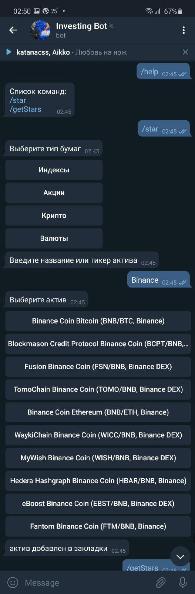
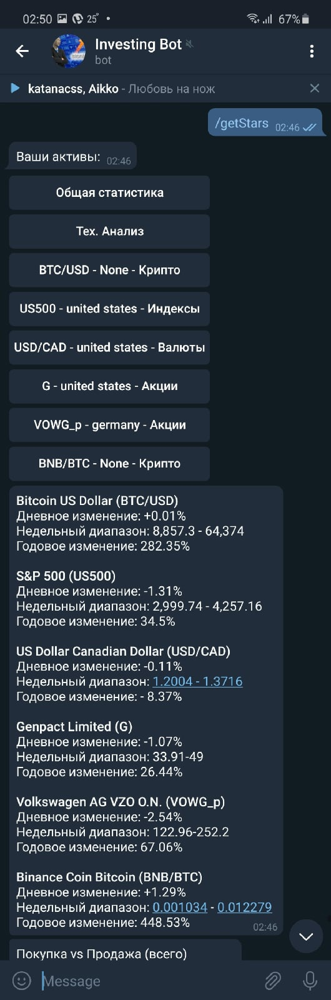
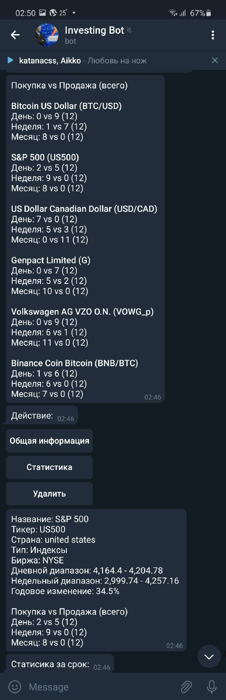
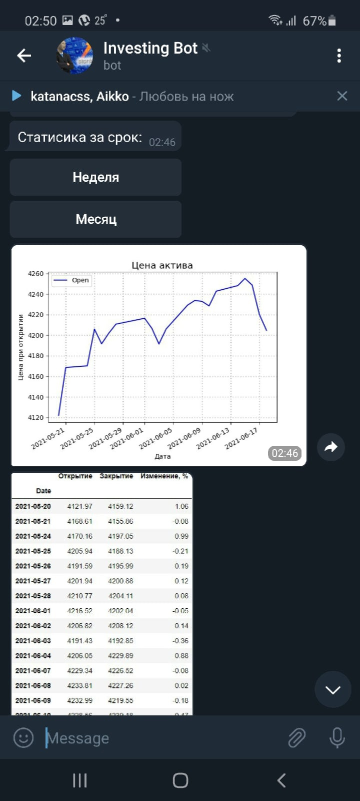

# InvestingBot

Телеграмм-бот, который позволяет осуществлять поиск и отслеживание характеристик ценных бумаг на Investing.com. Выбранные активы сохраняются в БД PostgreSQL.

## Основные возможности и функции

- Поиск и добавление актива в список избранных (перед поиском выбирается тип актива)

- Просмотр основных параметров всех активов в списке избранных

- Просмотр данных тех. анализа всех активов в списке избранных

- Просмотр подробной информации о выбранном активе

- Просмотр динамики цен на актив за неделю/месяц

## Скриншоты

